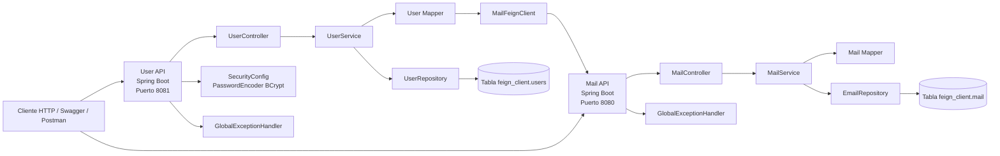
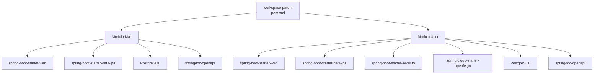
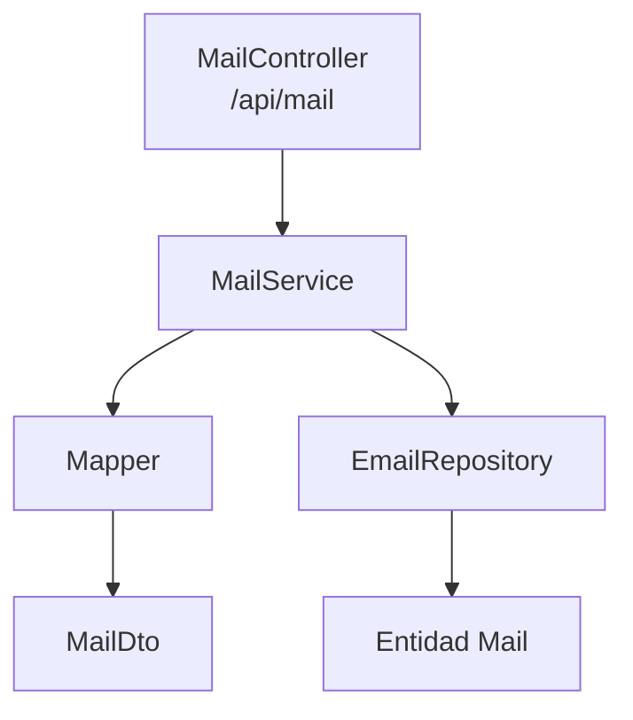
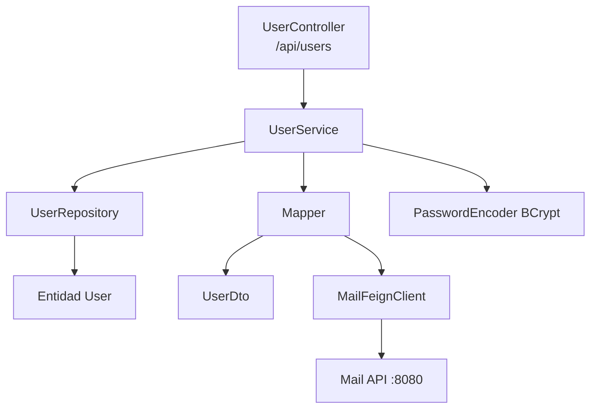
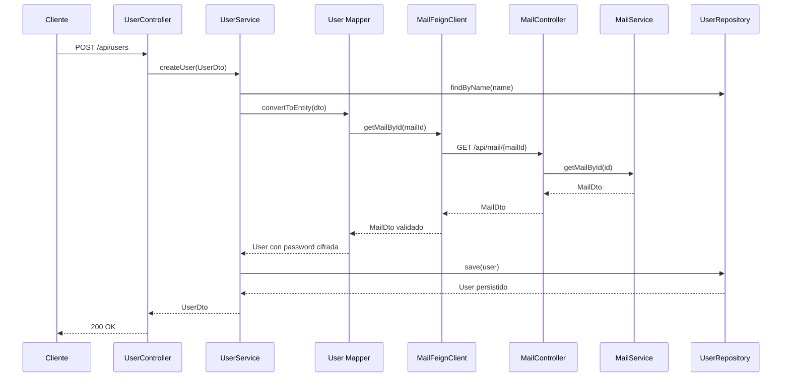
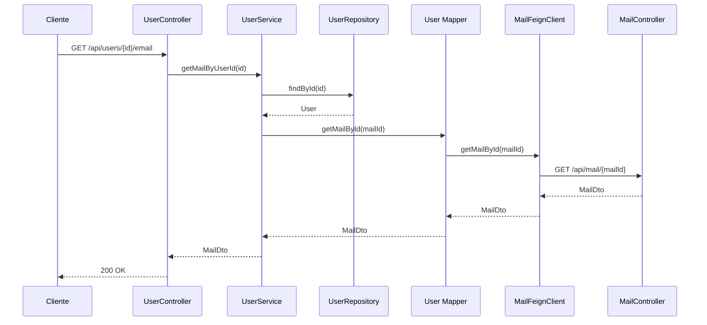
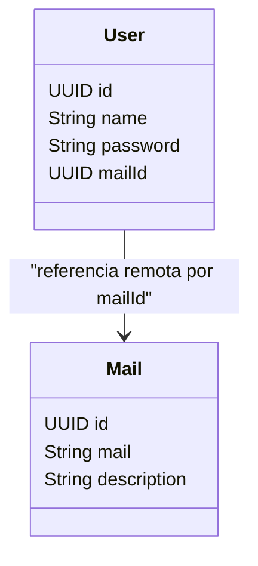
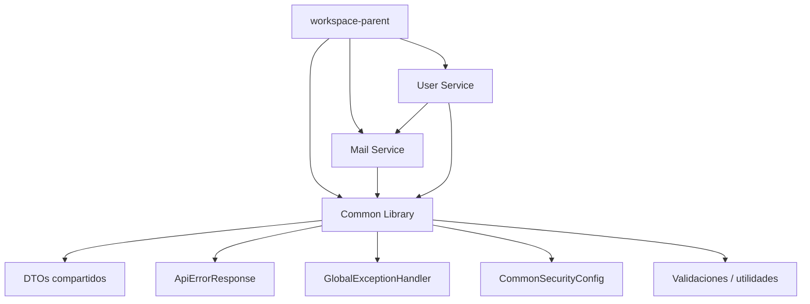

# Apuntes de Spring Boot Feign Client

Este workspace está organizado como un proyecto Maven multi-módulo con dos aplicaciones:

- `Mail`
- `User`

La idea general es que `User` consume endpoints HTTP de `Mail` usando `Feign Client`.

## Estructura de los `pom.xml`

En este proyecto hay un `pom` padre y dos `pom` hijos:

- `pom.xml` en la raíz
- `Mail/pom.xml`
- `User/pom.xml`

## 1. `pom.xml` padre

El archivo raíz `pom.xml` actúa como padre del workspace.

Su función principal es:

- agrupar los módulos `Mail` y `User`
- compartir configuración común
- centralizar versiones

En el padre aparece:

```xml
<packaging>pom</packaging>
```

Eso significa que el proyecto raíz no genera un `jar` ejecutable, sino que sirve para coordinar módulos.

También aparecen:

```xml
<modules>
    <module>Mail</module>
    <module>User</module>
</modules>
```

Con esto Maven sabe que el workspace está formado por esos dos subproyectos.

Además, el padre define propiedades y dependencias comunes, por ejemplo:

- `java.version`
- `spring.boot.version`
- `lombok.version`

Y dentro de `dependencyManagement` fija versiones para que los hijos no tengan que repetirlas continuamente.

## 2. `pom.xml` hijos

Tanto `Mail/pom.xml` como `User/pom.xml` heredan del padre mediante:

```xml
<parent>
    <groupId>springboot.feignclient</groupId>
    <artifactId>workspace-parent</artifactId>
    <version>1.0.0</version>
    <relativePath>../pom.xml</relativePath>
</parent>
```

Esto permite que ambos módulos:

- reutilicen configuración común
- compartan versiones
- mantengan una estructura más limpia

Después, cada hijo añade sus propias dependencias según su responsabilidad.

## 3. Qué aporta cada hijo

### `Mail`

`Mail` es el microservicio que expone endpoints como:

- `GET /api/mail/{id}`
- `GET /api/mail/name/{name}`

Su trabajo es gestionar correos electrónicos y devolver datos de tipo `MailDto`.

### `User`

`User` es el microservicio que gestiona usuarios y, además, consume datos del proyecto `Mail`.

Aquí es donde aparece el uso real de `Feign Client`, porque `User` necesita llamar a:

- `GET /api/mail/{id}`
- `GET /api/mail/name/{name}`

para validar o recuperar información de correo.

## 4. Dependencia necesaria para Feign Client

Para que Feign funcione en un módulo, ese módulo debe incluir la dependencia:

```xml
<dependency>
    <groupId>org.springframework.cloud</groupId>
    <artifactId>spring-cloud-starter-openfeign</artifactId>
</dependency>
```

Y además suele importar el BOM de Spring Cloud en `dependencyManagement`:

```xml
<dependencyManagement>
    <dependencies>
        <dependency>
            <groupId>org.springframework.cloud</groupId>
            <artifactId>spring-cloud-dependencies</artifactId>
            <version>2023.0.1</version>
            <type>pom</type>
            <scope>import</scope>
        </dependency>
    </dependencies>
</dependencyManagement>
```

## 5. Importante sobre los hijos y Feign

En esta práctica, los dos hijos tienen declarada la dependencia de OpenFeign en sus `pom.xml`.

Eso puede venir bien como apunte porque deja ambos módulos preparados para usar clientes Feign.

Pero siendo precisos:

- el módulo que consume otro servicio sí necesita `spring-cloud-starter-openfeign`
- el módulo que solo expone endpoints no tiene por qué necesitarla

En este proyecto, el consumidor claro es `User`, porque define:

- `MailFeignClient`

Por tanto, para que esta integración funcione de verdad, el hijo `User` sí debe incluir esa dependencia.

`Mail` no la necesita por exponer controladores, sino solo si también fuera a consumir otro microservicio mediante Feign.

## 6. Relación entre padre e hijos

La idea práctica es esta:

- el `pom` padre organiza el workspace
- cada hijo hereda del padre
- cada hijo declara sus dependencias concretas
- `User` añade lo necesario para consumir `Mail` con Feign

Dicho de otra forma:

- el padre comparte estructura
- los hijos implementan comportamiento

## 7. Flujo resumido de Feign en este workspace

1. `Mail` publica endpoints REST.
2. `User` declara una interfaz `MailFeignClient`.
3. `User` llama a `Mail` como si fuera un método Java normal.
4. OpenFeign convierte esa llamada en una petición HTTP real.
5. La respuesta se transforma en `MailDto`.

## 8. Idea clave

El `pom` padre no hace que Feign funcione por sí solo.

Lo que hace es organizar y compartir configuración.

Para que Feign funcione correctamente, el módulo hijo que vaya a consumir otro servicio debe declarar la dependencia de OpenFeign y configurar su cliente.

## 9. Arquitectura de los proyectos Mail y User

Este workspace es un proyecto Maven multi-modulo con dos microservicios Spring Boot:

- `Mail`: expone y gestiona el recurso de correos electronicos.
- `User`: gestiona usuarios y consume `Mail` mediante OpenFeign.

 [Dejo un enlace de cómo funciona feign client: ](https://github.com/AlvaroBlancoS/Apuntes_Java/tree/spring_boot/feign_client/User/src/main/java/springboot/feignclient/user/client)

### Vista general



### Estructura del workspace



### Arquitectura interna de Mail

#### Responsabilidad

`Mail` es el microservicio proveedor. Su funcion es ofrecer CRUD sobre correos electronicos y servir como fuente remota para `User`.

#### Capas



#### Componentes principales

- `MailApplication`: arranque del microservicio Spring Boot.
- `MailController`: expone endpoints REST para listar, buscar, crear, actualizar y eliminar mails.
- `MailService`: concentra la logica de negocio y validaciones de existencia.
- `EmailRepository`: acceso a datos con Spring Data JPA.
- `Mail`: entidad persistida en la tabla `feign_client.mail`.
- `MailDto`: contrato de entrada y salida del API.
- `Mapper`: convierte entre `Mail` y `MailDto`.
- `GlobalExceptionHandler`: devuelve errores de validacion con formato consistente.

#### Endpoints de Mail

- `GET /api/mail`
- `GET /api/mail/{id}`
- `GET /api/mail/name/{name}`
- `POST /api/mail`
- `PUT /api/mail/{id}`
- `DELETE /api/mail/{id}`
- `DELETE /api/mail/name/{name}`

### Arquitectura interna de User

#### Responsabilidad

`User` es el microservicio consumidor. Gestiona usuarios, codifica contrasenas y consulta el servicio `Mail` para validar o recuperar el correo asociado.

#### Capas



#### Componentes principales

- `UserApplication`: arranque del microservicio Spring Boot con Feign habilitado.
- `UserController`: expone endpoints de usuarios, login, cambio de contrasena y consultas cruzadas con mail.
- `UserService`: contiene la logica principal del dominio usuario.
- `Mapper`: transforma `UserDto` a `User`, codifica password y resuelve `mailId` usando Feign.
- `MailFeignClient`: cliente HTTP declarativo hacia `http://localhost:8080`.
- `UserRepository`: acceso a datos con Spring Data JPA.
- `User`: entidad persistida en la tabla `feign_client.users`.
- `UserDto`, `LoginUserDto`, `ChangePasswordDto`, `MailDto`: contratos del API.
- `SecurityConfig`: define `BCryptPasswordEncoder` y deja los endpoints abiertos.
- `GlobalExceptionHandler`: uniformiza errores de validacion.

#### Endpoints destacados de User

- `GET /api/users`
- `GET /api/users/{id}`
- `GET /api/users/name/{name}`
- `POST /api/users`
- `PUT /api/users`
- `DELETE /api/users/{id}`
- `DELETE /api/users/name/{name}`
- `POST /api/users/login/secure`
- `GET /api/users/login/version2`
- `PUT /api/users/changePassword`
- `PUT /api/users/changePassword/secure`
- `GET /api/users/{id}/email`
- `GET /api/users/name/{name}/email`
- `GET /api/users/email/{email}`

### Relacion entre ambos proyectos

La relacion entre ambos servicios no es por clave foranea JPA directa, sino por integracion HTTP:

- `User` guarda un `mailId` de tipo `UUID`.
- Cuando necesita informacion del correo, llama al microservicio `Mail`.
- Esa llamada se hace con `MailFeignClient`.
- `Mail` responde con `MailDto`.
- `User` compone la respuesta final para el cliente.

### Flujo principal: crear un usuario



### Flujo principal: obtener email de un usuario



### Modelo de datos



### Puntos clave de la arquitectura

- La raiz del proyecto solo organiza dependencias y modulos.
- `Mail` actua como proveedor del dato de correo.
- `User` actua como consumidor y orquestador del dato de usuario.
- La integracion entre ambos servicios es sincrona por HTTP con OpenFeign.
- `User` valida indirectamente la existencia del correo antes de guardar un usuario.
- Las contrasenas se almacenan cifradas con `BCryptPasswordEncoder`.
- Ambos servicios usan Spring Data JPA y PostgreSQL.
- Ambos servicios exponen documentacion REST con Swagger/OpenAPI.

### Archivos clave

- `pom.xml`
- `Mail/pom.xml`
- `User/pom.xml`
- `Mail/src/main/java/springboot/feignclient/mail/controller/MailController.java`
- `Mail/src/main/java/springboot/feignclient/mail/service/MailService.java`
- `Mail/src/main/java/springboot/feignclient/mail/repository/EmailRepository.java`
- `User/src/main/java/springboot/feignclient/user/controller/UserController.java`
- `User/src/main/java/springboot/feignclient/user/service/UserService.java`
- `User/src/main/java/springboot/feignclient/user/client/MailFeignClient.java`
- `User/src/main/java/springboot/feignclient/user/mapper/Mapper.java`
- `User/src/main/java/springboot/feignclient/user/util/SecurityConfig.java`

### Resumen final

La arquitectura sigue un estilo de microservicios simple:

- `Mail` encapsula el dominio de correos.
- `User` encapsula el dominio de usuarios.
- `User` depende funcionalmente de `Mail` por medio de Feign.
- La union real entre ambos dominios se hace por `UUID` y llamadas REST, no por relacion JPA compartida.
-------------------------------------

## 10. Propuesta de libreria comun para evitar duplicacion

En la arquitectura actual hay varias piezas repetidas entre `Mail` y `User`. Esto funciona para una practica pequena, pero en el siguiente proyecto conviene extraer lo compartido a una libreria comun para reducir duplicacion, centralizar mantenimiento y hacer la arquitectura mas limpia.

### Problemas detectados

#### 1. `SecurityConfig` y `PasswordEncoder` en `User`

Actualmente `User` define:

- `SecurityConfig`
- `PasswordEncoder` con `BCryptPasswordEncoder`

Esto no esta duplicado literalmente en `Mail`, pero si en futuros microservicios aparece la misma necesidad, se volvera a copiar la misma configuracion.

La idea correcta para el siguiente proyecto es mover la configuracion de seguridad comun a una libreria reutilizable.

## 2. `GlobalExceptionHandler` duplicado

Ahora mismo existe un `GlobalExceptionHandler` en:

- `Mail`
- `User`

Ambos hacen practicamente lo mismo:

- capturan `MethodArgumentNotValidException`
- obtienen el primer error de validacion
- construyen un `Map<String, Object>`
- devuelven una respuesta `400 Bad Request`

Esta es una duplicacion clara y deberia centralizarse en una libreria comun.

### 3. `MailDto` repetido en `User`

El proyecto `User` tiene su propio `MailDto`, aunque el dato realmente pertenece al dominio `Mail`.

Eso genera varios problemas:

- duplicacion del contrato
- riesgo de que un `MailDto` cambie en `Mail` y no en `User`
- acoplamiento manual innecesario
- mantenimiento mas costoso

Si `User` necesita usar `MailDto`, lo razonable es que ese DTO viva en un modulo compartido.

## 4. Entidades y DTOs repartidos por proyecto

Actualmente cada microservicio define sus propias entidades y DTOs dentro de su propio modulo.

Eso esta bien mientras cada dominio sea totalmente aislado, pero en este caso ya existe un contrato compartido entre servicios:

- `MailDto`
- identificadores `UUID`
- posibles respuestas comunes
- estructuras de error

Para el siguiente proyecto seria muy interesante extraer a una libreria comun:

- DTOs compartidos
- entidades base o modelos comunes
- respuestas de error
- configuraciones tecnicas reutilizables

### Que conviene mover a una libreria comun

### Opcion recomendada: crear un modulo `common-library`

Ejemplo de nombre:

- `Common`
- `shared-kernel`
- `common-library`
- `feign-client-common`

La opcion mas clara para este workspace seria `Common`.

### Contenido recomendado de la libreria comun

#### 1. Excepciones y manejo de errores

- `GlobalExceptionHandler`
- DTO de error, por ejemplo `ApiErrorResponse`

En vez de construir un `Map<String, Object>`, seria mejor tener una clase tipada.

Ejemplo:

```java
public class ApiErrorResponse {
    private LocalDateTime timestamp;
    private int status;
    private String error;
    private String code;
    private String message;
    private String field;
    private Object rejectedValue;
    private String path;
}
```

Asi todos los microservicios responderian con el mismo formato.

#### 2. Configuracion de seguridad compartida

- clase de configuracion de seguridad base
- bean `PasswordEncoder`

Ejemplo:

```java
@Configuration
public class CommonSecurityConfig {

    @Bean
    public PasswordEncoder passwordEncoder() {
        return new BCryptPasswordEncoder();
    }
}
```

Si varios servicios van a usar cifrado de contrasenas o politicas similares, esta pieza no deberia reescribirse.

#### 3. DTOs compartidos

- `MailDto`
- posibles DTOs base
- contratos comunes entre servicios

Si `User` consume `Mail`, no deberia redefinir `MailDto`; deberia importarlo desde la libreria comun.

#### 4. Entidades o modelos compartidos

Aqui conviene hacer una pequena pausa de diseno:

- si las entidades JPA van a ser persistidas por servicios distintos, no siempre es buena idea compartir la entidad completa
- lo que si suele compartirse mejor son los DTOs, enums, clases base y modelos de contrato

Por tanto, la recomendacion mas segura es:

- compartir primero DTOs y modelos comunes
- compartir entidades solo si de verdad forman parte de un mismo nucleo reutilizable

### Recomendacion sobre entidades

#### Lo mas prudente

Mover a la libreria comun:

- `MailDto`
- posibles `UserDto` reducidos si otros servicios los consumen
- `ApiErrorResponse`
- validaciones comunes
- configuraciones comunes

### Con cautela

Mover entidades JPA como:

- `Mail`
- `User`

solo si:

- varios modulos necesitan exactamente la misma definicion
- comparten el mismo modelo de persistencia
- no se rompe la independencia de cada microservicio

En microservicios reales, compartir entidades JPA entre servicios puede aumentar el acoplamiento. Lo normal es compartir contratos, no toda la persistencia.

### 11. Arquitectura propuesta



### Estructura sugerida

```text
pom.xml
Common/
  src/main/java/.../common/config/CommonSecurityConfig.java
  src/main/java/.../common/exception/GlobalExceptionHandler.java
  src/main/java/.../common/dto/MailDto.java
  src/main/java/.../common/dto/ApiErrorResponse.java
  src/main/java/.../common/util/...
Mail/
User/
```

### Beneficios

- se elimina duplicacion
- se centraliza el mantenimiento
- se evita que `MailDto` exista en dos sitios
- se estandariza el manejo de errores
- se reutiliza la configuracion de seguridad
- se prepara mejor el workspace para crecer a mas microservicios

### Riesgos y criterio de diseno

- no conviene meter toda la logica de negocio en la libreria comun
- no conviene compartir entidades JPA sin necesidad
- la libreria comun debe contener solo lo verdaderamente transversal

La clave es esta:

- compartir infraestructura comun
- compartir contratos comunes
- no mezclar dominios de negocio distintos

### Recomendacion final

Para el proximo proyecto, la mejor mejora estructural seria crear un tercer modulo Maven llamado `Common` y mover alli:

- `GlobalExceptionHandler`
- `ApiErrorResponse`
- `CommonSecurityConfig`
- `PasswordEncoder`
- `MailDto`
- DTOs compartidos adicionales
- utilidades y validaciones comunes

Respecto a las entidades:

- si buscas bajo acoplamiento entre microservicios, comparte DTOs y no entidades JPA completas
- si el objetivo es academico o de reutilizacion interna controlada, se puede estudiar mover algunas entidades base a la libreria comun

### Conclusión

Sí, tiene mucho sentido crear una libreria comun.

Los dos sintomas mas claros que lo justifican son:

- `GlobalExceptionHandler` repetido
- `MailDto` duplicado en `User`

Y como evolucion natural de la arquitectura, tambien es buena idea centralizar:

- configuracion de seguridad
- `PasswordEncoder`
- respuestas de error
- DTOs y modelos compartidos

Eso dejaria los proyectos `Mail` y `User` mas enfocados en su propia logica de negocio y menos cargados de codigo repetido.


