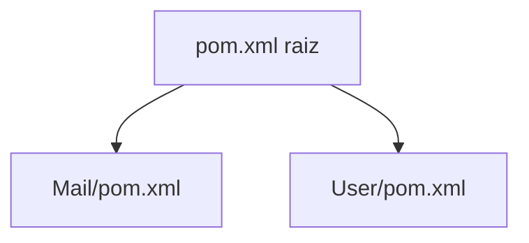
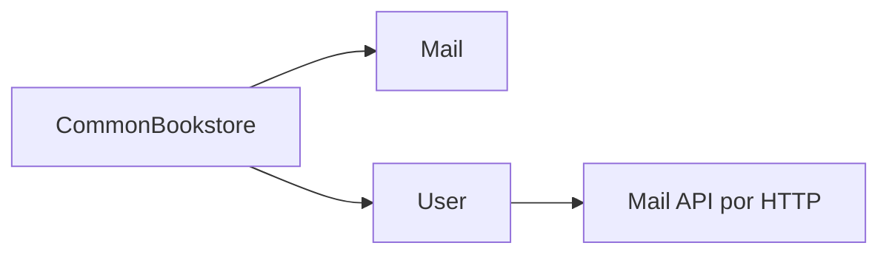

# Apuntes de Spring Boot con Maven Multi-modulo

Este workspace esta organizado como un proyecto Maven multi-modulo con tres modulos:

- `CommonBookstore`
- `Mail`
- `User`

El objetivo general es:

- `Mail` expone recursos REST de correo
- `User` consume esos recursos desde otro microservicio
- `CommonBookstore` centraliza contratos y componentes compartidos

## 1. Diagrama: pom padre e hijos

El `pom` padre real del proyecto es el `pom.xml` de la raiz.

Los tres modulos cuelgan de ese padre:

## Como entenderlo sin confundirse

Hay dos relaciones distintas:

### Herencia Maven

- el padre es el `pom.xml` de la raiz
- `CommonBookstore`, `Mail` y `User` son hijos de ese padre

### Dependencias entre modulos

- `Mail` depende de `CommonBookstore`
- `User` depende de `CommonBookstore`
- `User` consume por HTTP al servicio `Mail`

Diagrama de dependencias funcionales:

## 2. Por que necesitamos la libreria `CommonBookstore`

La libreria `CommonBookstore` aparece para evitar duplicacion entre modulos.

Antes habia codigo repetido o facilmente repetible en varios proyectos, por ejemplo:

- `MailDto`
- `GlobalExceptionHandler`
- estructura comun para errores
- configuraciones o contratos reutilizables

## Problema sin libreria comun

Si cada microservicio define por separado las mismas clases:

- se duplica codigo
- aumenta el mantenimiento
- puede haber inconsistencias entre proyectos
- un cambio en un contrato obliga a recordar actualizar varios sitios

Ejemplo claro:

- `User` necesitaba usar `MailDto`
- pero `MailDto` pertenece al contrato del recurso `Mail`
- duplicarlo dentro de `User` era una mala señal de diseno

## Solucion con `CommonBookstore`

Con la libreria comun:

- `MailDto` vive en un solo sitio
- el manejo comun de errores tambien puede vivir en un solo sitio
- `Mail` y `User` reutilizan el mismo contrato
- el proyecto queda mejor preparado para crecer

## Que tipo de cosas van bien en `CommonBookstore`

- DTOs compartidos
- respuestas de error comunes
- `GlobalExceptionHandler`
- configuraciones tecnicas reutilizables
- enums, validaciones y utilidades transversales

## Que cosas no conviene meter ahi sin pensarlo bien

- logica de negocio especifica de `Mail`
- logica de negocio especifica de `User`
- controladores
- servicios de dominio
- entidades JPA completas si eso acopla demasiado los microservicios

La idea sana es:

- compartir contratos
- compartir infraestructura comun
- no mezclar dominios que deberian seguir separados

## 3. Como se usa `RestTemplate` entre `User` y `Mail`

Ahora mismo el proyecto `User` consume el proyecto `Mail` usando `RestTemplate`.

La logica del cliente HTTP esta dentro del paquete `client` de `User`.

Enlace directo a la guia:

- [Guia de RestTemplate en User/client](E:\MiGitHub\Apuntes_Java\User\src\main\java\springboot\resttemplate\user\client\README.md)

## Resumen rapido del flujo

## Idea final

Este workspace se entiende mejor si lo separas mentalmente asi:

- `pom.xml` raiz: organiza y gobierna el multi-modulo
- `CommonBookstore`: comparte piezas comunes
- `Mail`: expone el dominio de correo
- `User`: gestiona usuarios y consulta `Mail` con `RestTemplate`
