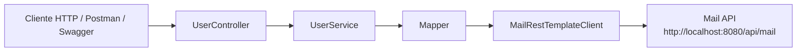
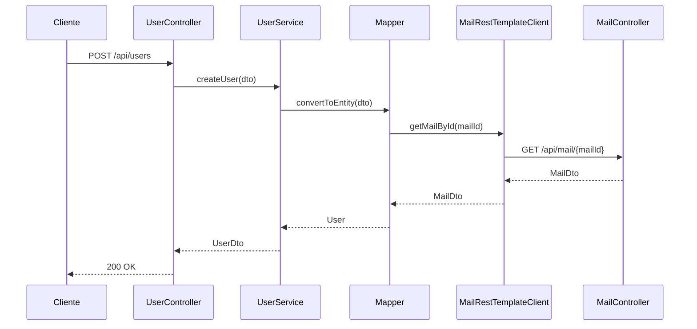

# Guia de RestTemplate entre `User` y `Mail`

## Objetivo

En este proyecto, el microservicio `User` necesita consultar informacion del microservicio `Mail`.

La comunicacion entre ambos se hace mediante `RestTemplate`.

La idea es sencilla:

- `Mail` expone endpoints REST
- `User` hace peticiones HTTP a esos endpoints
- el cliente HTTP esta dentro del paquete `client`

## Donde esta el cliente

El cliente que hace la llamada HTTP esta en:

- `User/src/main/java/springboot/resttemplate/user/client/MailRestTemplateClient.java`

Ese archivo pertenece al paquete:

```java
package springboot.resttemplate.user.client;
```

Por eso tiene sentido que el proyecto `User` tenga dentro de `client` la clase encargada de hablar con `Mail`.

## Flujo general



## Papel de cada pieza

### 1. `Mail`

`Mail` es el microservicio proveedor.

Expone endpoints como:

- `GET /api/mail/{id}`
- `GET /api/mail/name/{name}`

## 2. `User`

`User` es el microservicio consumidor.

Cuando necesita validar o recuperar el email asociado a un usuario, llama a `Mail`.

### 3. `MailRestTemplateClient`

Esta clase encapsula las llamadas HTTP salientes desde `User` hacia `Mail`.

Ejemplo real del proyecto:

```java
@Component
public class MailRestTemplateClient {

    private static final String MAIL_BASE_URL = "http://localhost:8080/api/mail";

    private final RestTemplate restTemplate;

    public MailRestTemplateClient(RestTemplate restTemplate) {
        this.restTemplate = restTemplate;
    }

    public MailDto getMailById(UUID id) {
        return restTemplate.getForObject(MAIL_BASE_URL + "/" + id, MailDto.class);
    }
}
```

La responsabilidad de esta clase es:

- construir la URL
- lanzar la peticion HTTP
- convertir la respuesta en `MailDto`

## 4. `RestTemplateConfig`

Para poder inyectar `RestTemplate`, primero hay que declarar un bean.

Eso se hace en:

- `User/src/main/java/springboot/resttemplate/user/util/RestTemplateConfig.java`

Ejemplo:

```java
@Configuration
public class RestTemplateConfig {

    @Bean
    public RestTemplate restTemplate() {
        return new RestTemplate();
    }
}
```

Sin este bean, Spring no podria inyectar `RestTemplate` en `MailRestTemplateClient`.

## 5. Como se usa desde `Mapper`

En este proyecto, `Mapper` usa el cliente HTTP para recuperar el mail remoto.

Ejemplo real:

```java
public MailDto getMailById(UUID idMail) {
    MailDto mailDto = mailRestTemplateClient.getMailById(idMail);
    if (mailDto == null) {
        throw new ResponseStatusException(HttpStatus.NOT_FOUND, "El mail con id " + idMail + " no existe");
    }
    return mailDto;
}
```

Esto significa que:

- `User` no inventa el email
- `User` pregunta a `Mail`
- si `Mail` no encuentra ese recurso, `User` responde con error controlado

## Flujo completo al crear un usuario



## Ejemplo de llamada con `RestTemplate`

La llamada mas importante del proyecto es esta:

```java
restTemplate.getForObject(MAIL_BASE_URL + "/" + id, MailDto.class);
```

Aqui ocurre lo siguiente:

1. se construye la URL final, por ejemplo `http://localhost:8080/api/mail/123`
2. `RestTemplate` hace una peticion `GET`
3. Spring convierte la respuesta JSON en un objeto `MailDto`

## Metodos actuales del cliente

Actualmente `MailRestTemplateClient` tiene:

- `getMailById(UUID id)`
- `getMailByName(String name)`

Eso cubre las consultas que `User` necesita hacer contra `Mail`.

## Ventajas de este enfoque para aprender

- ves claramente la URL remota
- entiendes mejor la peticion HTTP
- comprendes donde se hace la llamada entre microservicios
- separas la logica de negocio del codigo de integracion

## Diferencia con Feign

Con `RestTemplate`:

- escribes la llamada HTTP de forma manual
- controlas la URL directamente
- el cliente es una clase normal

Con `Feign`:

- declaras una interfaz
- Spring genera la implementacion
- hay menos codigo manual

Resumen rapido:

- `RestTemplate` = aprender mejor como se hace la llamada
- `Feign` = escribir menos codigo

## Idea clave

En este proyecto, el paquete `client` dentro de `User` representa la capa de integracion con servicios externos.

Eso quiere decir:

- `controller` recibe peticiones
- `service` aplica logica
- `mapper` transforma datos
- `client` habla con otro microservicio

## Archivos importantes

- `User/src/main/java/springboot/resttemplate/user/client/MailRestTemplateClient.java`
- `User/src/main/java/springboot/resttemplate/user/util/RestTemplateConfig.java`
- `User/src/main/java/springboot/resttemplate/user/mapper/Mapper.java`
- `Mail/src/main/java/springboot/feignclient/mail/controller/MailController.java`

## Conclusión

La comunicacion entre `User` y `Mail` con `RestTemplate` se basa en una idea simple:

- `Mail` expone el recurso
- `User` consume el recurso
- `MailRestTemplateClient` centraliza las llamadas HTTP

Esa es la razon por la que el cliente vive dentro del paquete `client` del proyecto `User`.
